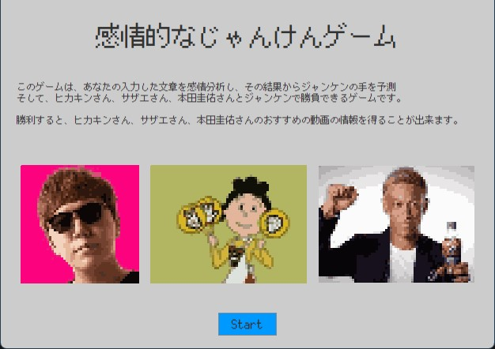
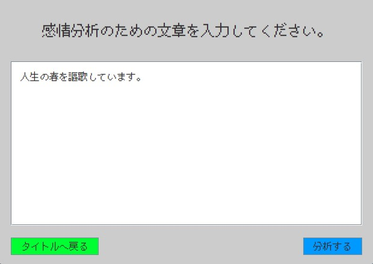
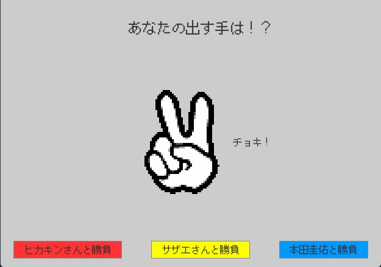

# 感情的なじゃんけんゲーム
このプログラムは、入力された文章を感情分析し、その分析結果からプレイヤーの出す手を決め、ヒカキンさん、サザエさん、本田圭佑さんと勝負できるというゲームである。

# DEMO

# Features
よくあるじゃんけんゲームは、プレイヤー自身がグー、チョキ、パーのどれを出すか選択して相手と戦うことができるが、プレイヤー自身が直接グー、チョキ、パーのどれかを決められないゲームというのは少ない。そこで、このゲームではプレイヤー自身が直接出す手を決められないじゃんけんゲームを作った。これによって、より面白いじゃんけんゲームができるはずである。

具体的には、プレイヤーが入力した文章を感情分析し、その分析結果からプレイヤーの出す手を決定。その後、対戦相手と勝負できるというじゃんけんゲームである。

このじゃんけんゲームでは、じゃんけんで有名であるヒカキンさん、サザエさん、本田圭佑さんとじゃんけんできるが、もしじゃんけんで勝てれば、文章から分析した感情をもとにそれぞれのYouTubeのおすすめ動画が表示される。

# Requirement

## Library
* gson 2.8.9
* jsoup 1.14.3

## API
* COTOHA API
* YouTube Data API v3

## じゃんけんのデータ
* [サザエさんジャンケン研究所](http://park11.wakwak.com/~hkn/)
* [ヒカキンジャンケン記録室](https://hikakinjunken.tk/)

# Usage

`janken.jar`がこのプログラムの実行ファイルです。

このリポジトリをクローンしていただき、上記の実行ファイルを実行すれば、ゲームで遊ぶことができます。

`src`ディレクトリにはこのプログラムのソースコードがあります。APIキーの箇所はセキュリティの関係で空白となっております。

# Note

jdkのバージョンは14

IDEはEclipseで作成しました。